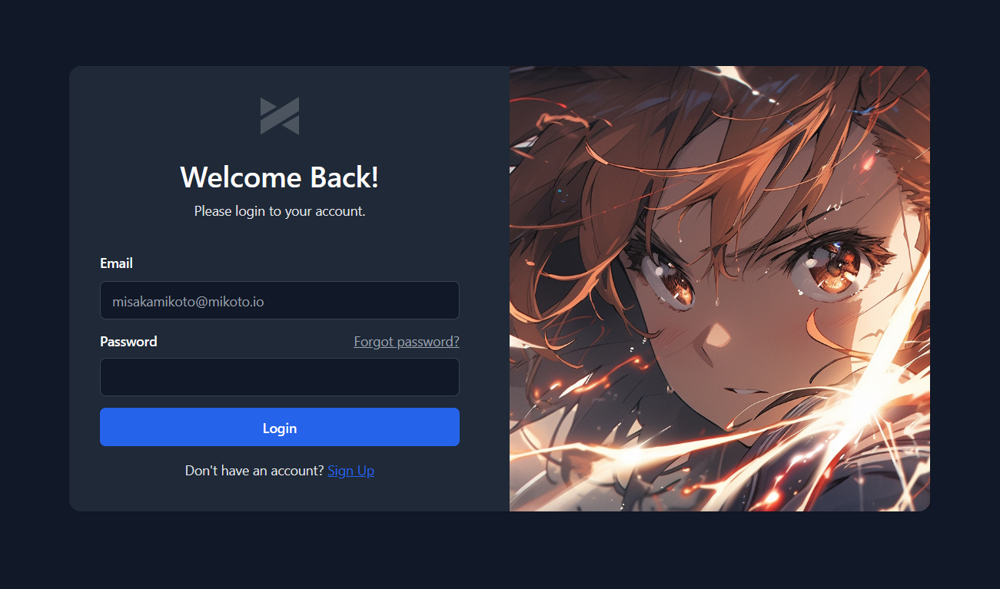

<h1 align="center">
  Superego
</h1>

> Log in to every site with a single ID that you own.

Superego is the experimental authenticator platform that will be introduced to Mikoto. It tries to use Decentralised Identifiers (DIDs) to handle user authentication. The platform is still in its early stages of development and is not ready for production use.

  

## Getting Started

TODO
